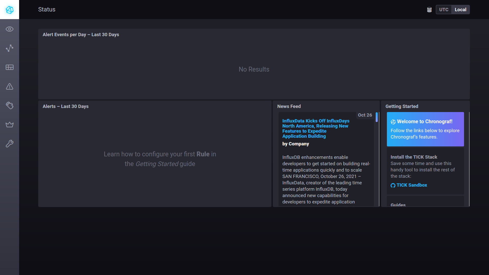

## Домашнее задание к занятию "10.02. Системы мониторинга"
***

### Задание 1
***
###  Задание 2
***
### Задание 3
> Клонировал репозиторий. Запустил TICK-стэк.
```
falconow@falconow:~$ docker ps
CONTAINER ID   IMAGE                   COMMAND                  CREATED          STATUS          PORTS                                                                                                                             NAMES
70b442608033   chrono_config           "/entrypoint.sh chro…"   30 minutes ago   Up 30 minutes   0.0.0.0:8888->8888/tcp, :::8888->8888/tcp                                                                                         sandbox_chronograf_1
29c095fe4dea   kapacitor               "/entrypoint.sh kapa…"   30 minutes ago   Up 30 minutes   0.0.0.0:9092->9092/tcp, :::9092->9092/tcp                                                                                         sandbox_kapacitor_1
601ce633c3bd   telegraf                "/entrypoint.sh tele…"   30 minutes ago   Up 30 minutes   8092/udp, 8125/udp, 8094/tcp                                                                                                      sandbox_telegraf_1
19d497ab182a   sandbox_documentation   "/documentation/docu…"   30 minutes ago   Up 30 minutes   0.0.0.0:3010->3000/tcp, :::3010->3000/tcp                                                                                         sandbox_documentation_1
f54637f388bd   influxdb                "/entrypoint.sh infl…"   30 minutes ago   Up 30 minutes   0.0.0.0:8082->8082/tcp, :::8082->8082/tcp, 0.0.0.0:8086->8086/tcp, :::8086->8086/tcp, 0.0.0.0:8089->8089/udp, :::8089->8089/udp   sandbox_influxdb_1
falconow@falconow:~$ 

```

> Запускаем команды curl. Некоторые команды возвращают пустую строку

1.  
```
falconow@falconow:~$ curl http://localhost:8086/ping
falconow@falconow:~$ 
falconow@falconow:~$ curl http://localhost:8888
<!DOCTYPE html><html><head><meta http-equiv="Content-type" content="text/html; charset=utf-8"><title>Chronograf</title><link rel="icon shortcut" href="/favicon.fa749080.ico"><link rel="stylesheet" href="/src.3dbae016.css"></head><body> <div id="react-root" data-basepath=""></div> <script src="/src.fab22342.js"></script> </body></html>falconow@falconow:~$ 
falconow@falconow:~$ 
falconow@falconow:~$ curl http://localhost:9092/kapacitor/v1/ping
falconow@falconow:~$ 
```
Скриншот



