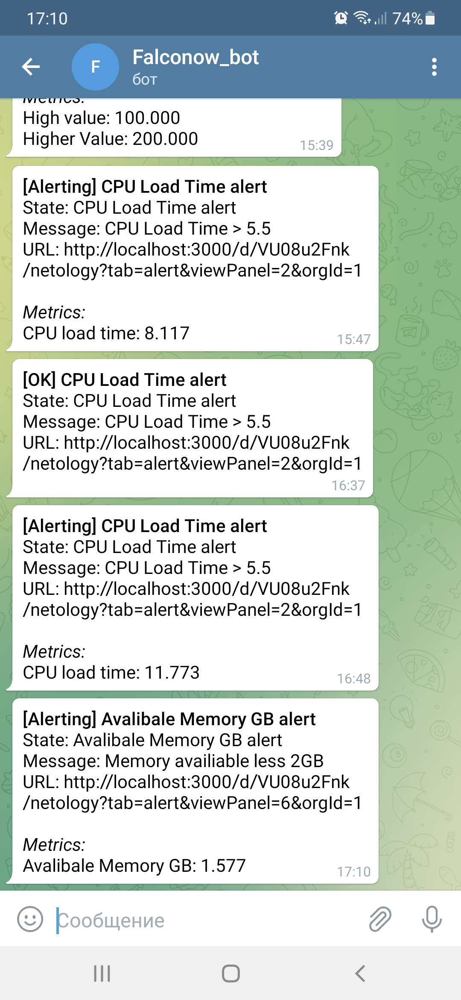

## Домашнее задание к занятию "10.03. Grafana"

Задание повышенной сложности
> Решил написать playbook для установки всех компонентов, но столкнулся с проблемой
рассинхронизации времени между сервером в YandexCloud и рабочим компьютером. 
Разобраться со всем этим не хватило времени, поэтому использовал готовый docker-compose.
***
### Задание 1
> С помощью docker-compose запустил связку prometheus-grafana.  
В grafana подклчил prometheus как источник данных.


***
### Задание 2
> Изучил статьи по использованию метрик состояния сервера.  
На их основе создал Dashboard с панелями.

 **Promql:**
- Утилизация CPU для nodeexporter (в процентах 100-idle):  
    - 100 - (avg by(instance) (rate(node_cpu_seconds_total{instance="nodeexporter:9100", mode="idle"}[5m])) * 100)
- CPULA 1/5/15:
    - node_load1
    - node_load5
    - node_load15
- Количество свободной оперативной памяти:
    - node_memory_MemAvailable_bytes/1024^3
- Количество места на файловой системе:
    - node_filesystem_avail_bytes{fstype!~"tmpfs|fuse.lxcfs|squashfs"} / node_filesystem_size_bytes{fstype!~"tmpfs|fuse.lxcfs|squashfs"}*100


***

### Задание 3
> Для создания Alert пришлось изменить вид панелей на графики.  
Создал бота в телеграмме, привязал его в канал нотификации.  
Добавил правила Alert для панелей. Протестировал отправку уведомлений.


***
### Задание 4
```
{
  "annotations": {
    "list": [
      {
        "builtIn": 1,
        "datasource": "-- Grafana --",
        "enable": true,
        "hide": true,
        "iconColor": "rgba(0, 211, 255, 1)",
        "name": "Annotations & Alerts",
        "type": "dashboard"
      }
    ]
  },
  "editable": true,
  "gnetId": null,
  "graphTooltip": 0,
  "id": 3,
  "links": [],
  "panels": [
    {
      "alert": {
        "alertRuleTags": {},
        "conditions": [
          {
            "evaluator": {
              "params": [
                5
              ],
              "type": "gt"
            },
            "operator": {
              "type": "and"
            },
            "query": {
              "params": [
                "A",
                "5m",
                "now"
              ]
            },
            "reducer": {
              "params": [],
              "type": "avg"
            },
            "type": "query"
          }
        ],
        "executionErrorState": "alerting",
        "for": "5m",
        "frequency": "1m",
        "handler": 1,
        "message": "CPU Load Time > 5.5",
        "name": "CPU Load Time alert",
        "noDataState": "no_data",
        "notifications": [
          {
            "uid": "J8xg3tK7z"
          }
        ]
      },
      "aliasColors": {},
      "bars": false,
      "dashLength": 10,
      "dashes": false,
      "datasource": null,
      "fieldConfig": {
        "defaults": {
          "color": {},
          "custom": {},
          "thresholds": {
            "mode": "absolute",
            "steps": []
          }
        },
        "overrides": []
      },
      "fill": 1,
      "fillGradient": 0,
      "gridPos": {
        "h": 6,
        "w": 11,
        "x": 0,
        "y": 0
      },
      "hiddenSeries": false,
      "id": 2,
      "legend": {
        "alignAsTable": false,
        "avg": false,
        "current": true,
        "max": false,
        "min": false,
        "rightSide": false,
        "show": true,
        "total": false,
        "values": true
      },
      "lines": true,
      "linewidth": 1,
      "nullPointMode": "null",
      "options": {
        "alertThreshold": true
      },
      "percentage": false,
      "pluginVersion": "7.4.0",
      "pointradius": 2,
      "points": false,
      "renderer": "flot",
      "seriesOverrides": [],
      "spaceLength": 10,
      "stack": false,
      "steppedLine": false,
      "targets": [
        {
          "expr": " 100 - (avg by(instance) (rate(node_cpu_seconds_total{instance=\"nodeexporter:9100\", mode=\"idle\"}[5m])) * 100)",
          "interval": "",
          "legendFormat": "CPU load time",
          "refId": "A"
        }
      ],
      "thresholds": [
        {
          "colorMode": "critical",
          "fill": true,
          "line": true,
          "op": "gt",
          "value": 5,
          "visible": true
        }
      ],
      "timeFrom": null,
      "timeRegions": [],
      "timeShift": null,
      "title": "CPU Load Time",
      "tooltip": {
        "shared": true,
        "sort": 0,
        "value_type": "individual"
      },
      "type": "graph",
      "xaxis": {
        "buckets": null,
        "mode": "time",
        "name": null,
        "show": true,
        "values": []
      },
      "yaxes": [
        {
          "$$hashKey": "object:344",
          "format": "short",
          "label": "",
          "logBase": 1,
          "max": null,
          "min": null,
          "show": true
        },
        {
          "$$hashKey": "object:345",
          "format": "short",
          "label": null,
          "logBase": 1,
          "max": null,
          "min": null,
          "show": true
        }
      ],
      "yaxis": {
        "align": false,
        "alignLevel": null
      }
    },
    {
      "alert": {
        "alertRuleTags": {},
        "conditions": [
          {
            "evaluator": {
              "params": [
                2
              ],
              "type": "lt"
            },
            "operator": {
              "type": "and"
            },
            "query": {
              "params": [
                "A",
                "1m",
                "now"
              ]
            },
            "reducer": {
              "params": [],
              "type": "avg"
            },
            "type": "query"
          }
        ],
        "executionErrorState": "alerting",
        "for": "5m",
        "frequency": "1m",
        "handler": 1,
        "message": "Memory availiable less 2GB",
        "name": "Avalibale Memory GB alert",
        "noDataState": "no_data",
        "notifications": []
      },
      "aliasColors": {},
      "bars": false,
      "dashLength": 10,
      "dashes": false,
      "datasource": null,
      "fieldConfig": {
        "defaults": {
          "color": {},
          "custom": {},
          "thresholds": {
            "mode": "absolute",
            "steps": []
          }
        },
        "overrides": []
      },
      "fill": 1,
      "fillGradient": 0,
      "gridPos": {
        "h": 6,
        "w": 12,
        "x": 11,
        "y": 0
      },
      "hiddenSeries": false,
      "id": 6,
      "legend": {
        "avg": false,
        "current": true,
        "max": false,
        "min": false,
        "show": true,
        "total": false,
        "values": true
      },
      "lines": true,
      "linewidth": 1,
      "nullPointMode": "null",
      "options": {
        "alertThreshold": true
      },
      "percentage": false,
      "pluginVersion": "7.4.0",
      "pointradius": 2,
      "points": false,
      "renderer": "flot",
      "seriesOverrides": [],
      "spaceLength": 10,
      "stack": false,
      "steppedLine": false,
      "targets": [
        {
          "expr": "node_memory_MemAvailable_bytes/1024^3",
          "interval": "",
          "legendFormat": "Avalibale Memory GB",
          "refId": "A"
        }
      ],
      "thresholds": [
        {
          "colorMode": "critical",
          "fill": true,
          "line": true,
          "op": "lt",
          "value": 2,
          "visible": true
        }
      ],
      "timeFrom": null,
      "timeRegions": [],
      "timeShift": null,
      "title": "Avalibale Memory GB",
      "tooltip": {
        "shared": true,
        "sort": 0,
        "value_type": "individual"
      },
      "type": "graph",
      "xaxis": {
        "buckets": null,
        "mode": "time",
        "name": null,
        "show": true,
        "values": []
      },
      "yaxes": [
        {
          "$$hashKey": "object:1476",
          "format": "short",
          "label": null,
          "logBase": 1,
          "max": null,
          "min": "0",
          "show": true
        },
        {
          "$$hashKey": "object:1477",
          "format": "short",
          "label": null,
          "logBase": 1,
          "max": null,
          "min": null,
          "show": true
        }
      ],
      "yaxis": {
        "align": false,
        "alignLevel": null
      }
    },
    {
      "alert": {
        "alertRuleTags": {},
        "conditions": [
          {
            "evaluator": {
              "params": [
                4
              ],
              "type": "gt"
            },
            "operator": {
              "type": "and"
            },
            "query": {
              "params": [
                "A",
                "5m",
                "now"
              ]
            },
            "reducer": {
              "params": [],
              "type": "avg"
            },
            "type": "query"
          }
        ],
        "executionErrorState": "alerting",
        "for": "5m",
        "frequency": "1m",
        "handler": 1,
        "message": "CPU Load Average is high",
        "name": "CPU Load Average alert",
        "noDataState": "no_data",
        "notifications": [
          {
            "uid": "J8xg3tK7z"
          }
        ]
      },
      "aliasColors": {},
      "bars": false,
      "dashLength": 10,
      "dashes": false,
      "datasource": null,
      "fieldConfig": {
        "defaults": {
          "color": {},
          "custom": {},
          "thresholds": {
            "mode": "absolute",
            "steps": []
          }
        },
        "overrides": []
      },
      "fill": 1,
      "fillGradient": 0,
      "gridPos": {
        "h": 7,
        "w": 11,
        "x": 0,
        "y": 6
      },
      "hiddenSeries": false,
      "id": 4,
      "legend": {
        "avg": false,
        "current": true,
        "max": false,
        "min": false,
        "show": true,
        "total": false,
        "values": true
      },
      "lines": true,
      "linewidth": 1,
      "nullPointMode": "null",
      "options": {
        "alertThreshold": true
      },
      "percentage": false,
      "pluginVersion": "7.4.0",
      "pointradius": 2,
      "points": false,
      "renderer": "flot",
      "seriesOverrides": [],
      "spaceLength": 10,
      "stack": false,
      "steppedLine": false,
      "targets": [
        {
          "expr": "node_load1",
          "interval": "",
          "legendFormat": "CPULA 1",
          "refId": "A"
        },
        {
          "expr": "node_load5",
          "hide": false,
          "interval": "",
          "legendFormat": "CPULA 5",
          "refId": "B"
        },
        {
          "expr": "node_load15",
          "hide": false,
          "interval": "",
          "legendFormat": "CPULA 15",
          "refId": "C"
        }
      ],
      "thresholds": [
        {
          "colorMode": "critical",
          "fill": true,
          "line": true,
          "op": "gt",
          "value": 4,
          "visible": true
        }
      ],
      "timeFrom": null,
      "timeRegions": [],
      "timeShift": null,
      "title": "CPU Load Average",
      "tooltip": {
        "shared": true,
        "sort": 0,
        "value_type": "individual"
      },
      "type": "graph",
      "xaxis": {
        "buckets": null,
        "mode": "time",
        "name": null,
        "show": true,
        "values": []
      },
      "yaxes": [
        {
          "$$hashKey": "object:2868",
          "format": "short",
          "label": null,
          "logBase": 1,
          "max": null,
          "min": null,
          "show": true
        },
        {
          "$$hashKey": "object:2869",
          "format": "short",
          "label": null,
          "logBase": 1,
          "max": null,
          "min": null,
          "show": true
        }
      ],
      "yaxis": {
        "align": false,
        "alignLevel": null
      }
    },
    {
      "alert": {
        "alertRuleTags": {},
        "conditions": [
          {
            "evaluator": {
              "params": [
                20
              ],
              "type": "gt"
            },
            "operator": {
              "type": "and"
            },
            "query": {
              "params": [
                "A",
                "5m",
                "now"
              ]
            },
            "reducer": {
              "params": [],
              "type": "avg"
            },
            "type": "query"
          }
        ],
        "executionErrorState": "alerting",
        "for": "5m",
        "frequency": "1m",
        "handler": 1,
        "message": "Disk Availiable < 20%",
        "name": "Disks Availible % alert",
        "noDataState": "no_data",
        "notifications": [
          {
            "uid": "J8xg3tK7z"
          }
        ]
      },
      "aliasColors": {},
      "bars": false,
      "dashLength": 10,
      "dashes": false,
      "datasource": null,
      "fieldConfig": {
        "defaults": {
          "color": {},
          "custom": {},
          "thresholds": {
            "mode": "absolute",
            "steps": []
          },
          "unit": "none"
        },
        "overrides": []
      },
      "fill": 1,
      "fillGradient": 0,
      "gridPos": {
        "h": 7,
        "w": 12,
        "x": 11,
        "y": 6
      },
      "hiddenSeries": false,
      "id": 8,
      "legend": {
        "avg": false,
        "current": true,
        "max": false,
        "min": false,
        "show": true,
        "total": false,
        "values": true
      },
      "lines": true,
      "linewidth": 1,
      "nullPointMode": "null",
      "options": {
        "alertThreshold": true
      },
      "percentage": false,
      "pluginVersion": "7.4.0",
      "pointradius": 2,
      "points": false,
      "renderer": "flot",
      "seriesOverrides": [],
      "spaceLength": 10,
      "stack": false,
      "steppedLine": false,
      "targets": [
        {
          "exemplar": false,
          "expr": "node_filesystem_avail_bytes{fstype!~\"tmpfs|fuse.lxcfs|squashfs\"} / node_filesystem_size_bytes{fstype!~\"tmpfs|fuse.lxcfs|squashfs\"}*100",
          "format": "time_series",
          "instant": false,
          "interval": "",
          "legendFormat": "{{device}}   %",
          "refId": "A"
        }
      ],
      "thresholds": [
        {
          "colorMode": "critical",
          "fill": true,
          "line": true,
          "op": "gt",
          "value": 20,
          "visible": true
        }
      ],
      "timeFrom": null,
      "timeRegions": [],
      "timeShift": null,
      "title": "Disks Availible %",
      "tooltip": {
        "shared": true,
        "sort": 0,
        "value_type": "individual"
      },
      "type": "graph",
      "xaxis": {
        "buckets": null,
        "mode": "time",
        "name": null,
        "show": true,
        "values": []
      },
      "yaxes": [
        {
          "$$hashKey": "object:3008",
          "format": "none",
          "label": null,
          "logBase": 1,
          "max": null,
          "min": "0",
          "show": true
        },
        {
          "$$hashKey": "object:3009",
          "format": "short",
          "label": null,
          "logBase": 1,
          "max": null,
          "min": null,
          "show": true
        }
      ],
      "yaxis": {
        "align": false,
        "alignLevel": null
      }
    }
  ],
  "refresh": "5s",
  "schemaVersion": 27,
  "style": "dark",
  "tags": [],
  "templating": {
    "list": []
  },
  "time": {
    "from": "now-15m",
    "to": "now"
  },
  "timepicker": {},
  "timezone": "",
  "title": "Netology",
  "uid": "VU08u2Fnk",
  "version": 30
}
```
***

