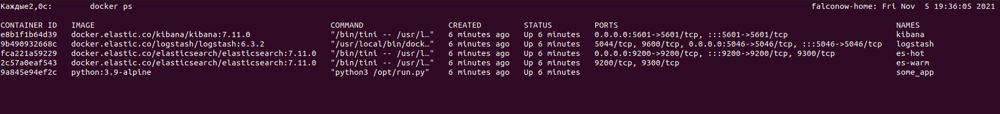
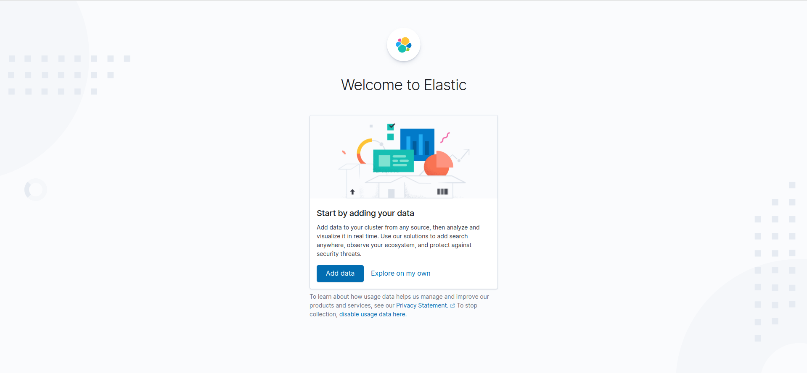

## Домашнее задание к занятию "10.04. ELK"

### Задание 1
> С помощью директории help поднял тестовый стэнд.   
Возникли проблемы с запуском контейнеров с elastic. Воспользовался ссылкой из раздела помощи: https://stackoverflow.com/questions/42889241/how-to-increase-vm-max-map-count

Сделал необходимые скриншоты  

Работающие контейнеры:

Kibana:

***

### Задание 2

> Индексов logstash-* не обнаружил. Не запустился контейнер с filebeat.  
Поправил в директории /help конфигурацию logstash. Добавил сеть в конейнер filebeat docker-compose.

