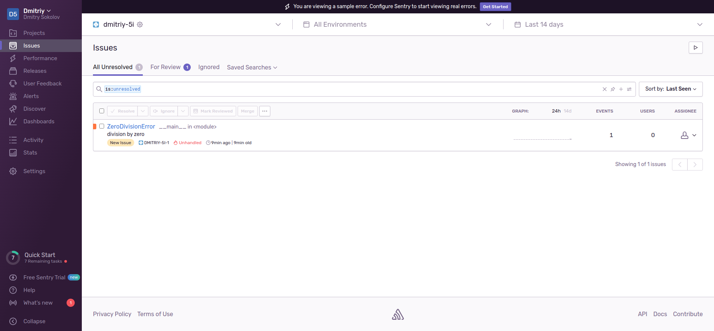
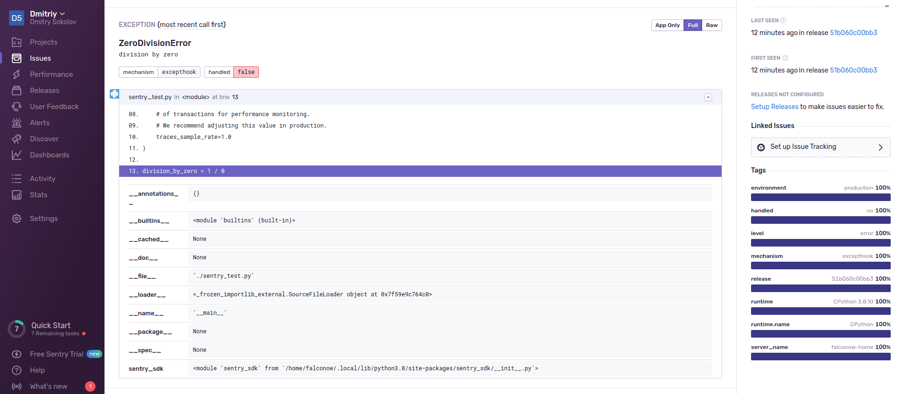
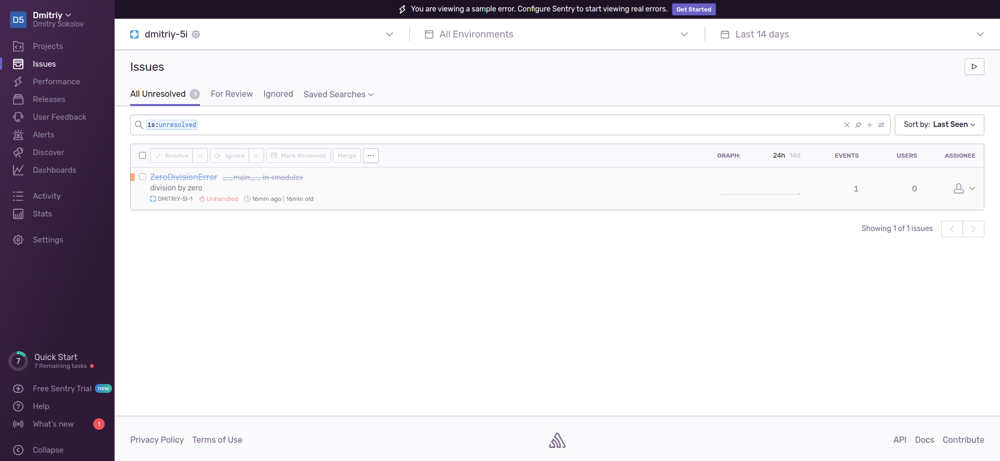
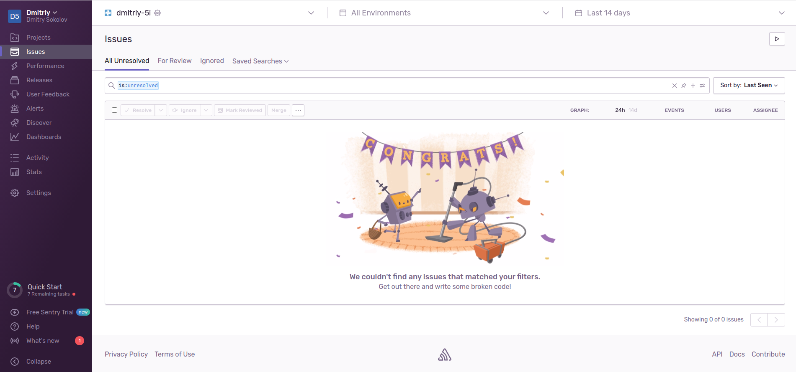
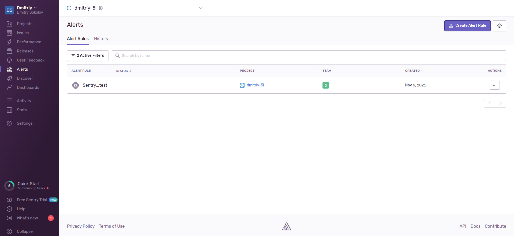
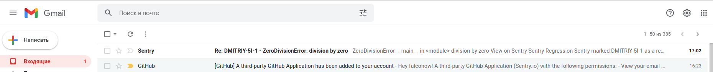
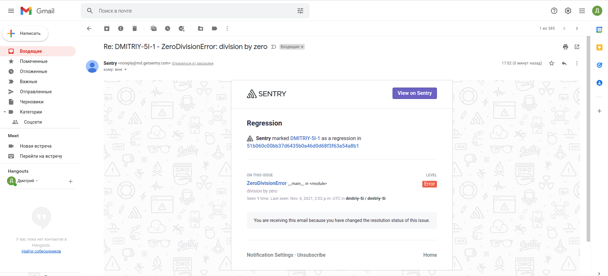

## Домашнее задание к занятию "10.05. Sentry"
### Задание 1

> Зарегистрировался на sentry.io

***

### Задание 2
> Сгенерировал тестовое событие

> Stack trace

> После нажатия кнопки "resolve"

> Обновленный список событий

***

### Задание 3
> Создал правило Alert  

> Сгенерировал событие повторно, получил уведомление на email

